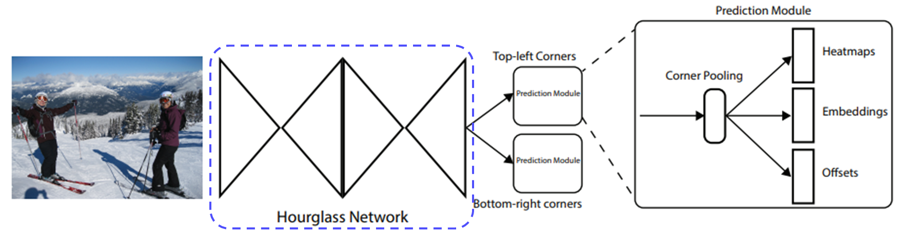

### Anchor box의 단점
- Anchor box의 수가 많음
    - 대부분이 배경(negative sample) -> class imbalance
- Anchor box의 파라미터를 휴리스틱하게 정해줘야 함
### CornerNet : Anchor box가 없는 1 stage detector (Free Anchor)
- 좌측 상단, 우측 하단 점만을 이용하여 객체 검출
### CornerNet Architecture
 

- 위에서 heatmap은 각 class의 코너가 있으며 1 없으면 0 표현
- embeddings는 각 코너를 클래스에 맵핑하는 벡터임
    - 즉, embedding 값이 작으면(가까우면) 같은 클래스를 가리키는 것이라는 표현
- offset은 코너의 위치를 조정(작은 Bbox는 작은 변화로도 큰 영향이 있기 때문)
---  
### Prediction Module
- Encoder로 통해 나온 feature map에서 각각 top-left, bottom-right 구하는 것
- detecting corner
    - 모든 negative 위치를 동일하게 패널티를 주는 것이 아니다
    - positive location 반지름 안에 들어오는 negative location들은 패널티 감소(loss 감소)
        - 반지름은 물체 크기에 따라 결정, 거리에 따라 패널티 감소
- Grouping corner
    - top-left 코너와 bottom-right 코너의 짝을 맞춰줌
    - 둘의 embedding 값의 차이에 따라 그룹을 지어줌
    - 거리가 작으면 같은 물체의 bounding box에 속한다고 생각
- corner pooling
    - 코너에는 특징적인 부분이 없음
    - 코너를 결정하기 위해서 corner pooling 과정 필요
