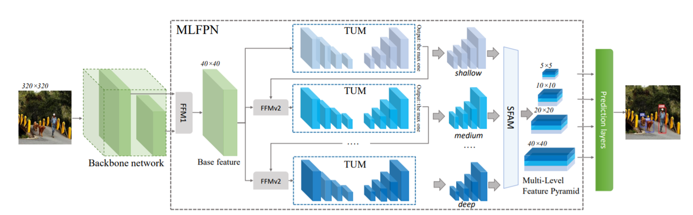

### Feature Pyramid 한계
- dtection task를 수행하기에는 충분하지 않음
- backbone network는 single-level layer로, single-level 정보만 나타냄
- 일반적으로, low-level feature는 간단한 외형을, high-level feature는 복잡한 외형을 나타냄
### M2Det
- Multi-level, Multi-scale feature pyramid 제안 (MLFPN)
- SSD에 합쳐서 M2Det라는 one stage detector 제안
 

- 위의 FFM: Feature Fusion Module
    - FFMv1: base feature 생성
        - Base feature: 서로 다른 scale의 2 feature map을 합쳐 semantic 정보가 풍부함
    - FFMv2: base feature와 이전 TUM 출력 중 가장 큰 feature concat
        - 다음 TUM의 입력으로 들어감
- TUM : Thinned U-shape Module
    - Encoder-Decoder 구조
- 위에서 deep한 feature map은 복잡한 외형을 가진 것을 잘 판별 shallow는 간단한 외형 잘 판별
- SFAM: Scale-wise feature Aggregation Module
    - TUMs에서 생성된 Multi-level, multi scale을 합치는 과정
    - 동일한 크기를 가진 feature들끼리 연결(scale-wise concatenation)
        - multi-scale을 가진 한 layer는 multi-level을 가지고 있음
        - 각 scale의 feature map은 객체 외형에 대한 다양한 semantic을 이해하고 있다.
- 그 이후 Channel-wise attention 도입 (SE block)
    - 채널별 가중치를 계산하여 각각의 feature를 강화시키거나 약화시킴
- 이후 SSD연산
    - 원래는 Extra feature layer를 구하는 연산을 적용하는데 아까 구한 feature map을 ssd feature map으로 사용
    