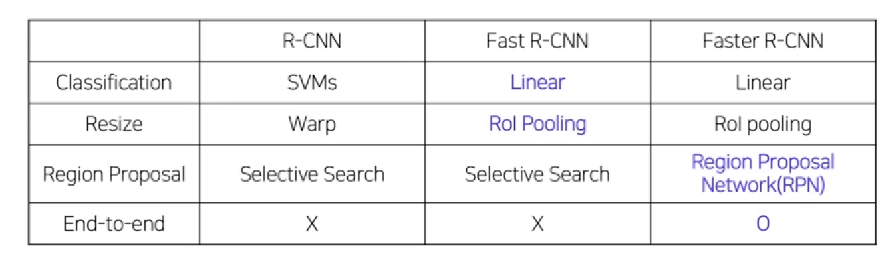

## 2 Stage Detectors
#### R-CNN
1. Input
2. Extract Region proposals(후보 뽑기)
    - sliding window (window의 모양은 다양함)
    - selective Search (image에 존재하는 특징들을 뽑고, 공통된 영역을 모음)
3. 고정된 size로 warp -> resize
4. 사전 학습된 ConvNet에 넣어서 고정된 output vector 얻음 (Computer CNN features)
5. classify Regions
---
#### R-CNN의 Pipeline
1. Input image
2. input image로부터 selective search를 통해 약 2000개의 ROI(Region of Interest) 추출 -> 2000개의 후보 영역을 뽑음
3. ROI의 크기를 조절해 모두 동일한 사이즈로 변형 (동일한 size로 warp)
    - warping하는 이유는 CNN의 마지막은 FC layer인데 얘는 입력 사이즈를 고정된 사이즈만 받기 때문
    - EX. 224x224x3 -> convolution Network -> 4x4x8 -> FC(128xC) 
    <tab>448x448x3 -> convolution Network -> 8x8x8 -> FC(512xC) 
    위처럼 FC layer가 받을 입력 size는 항상 고정
4. 동일 size의 2000개의 후보가 어떤 객체인지 예측해야함 -> semantic한 정보를 포함하고 있는 feature vector로 변환해야 함
    - 각 region 마다 4096-dim feature vector 추출 (2000x4096)
    - pretrained AlexNet 구조 활용(AlexNet마지막에 FC layer 추가, 필요에 따라 Finetuning)
    - pretrained AlexNet 통과하고 나면 semantic한 정보를 포함함
5. CNN을 통해 나온 feature를 Linear SVM에 넣어 분류 진행
    - Input = 2000x4096 features
    - Output = Class(C+1) + Confidence scores,  C+1=클래스 개수 + 배경여부 1개
6. CNN을 통해 나온 feature를 regression을 통해 bounding box 예측
    - 후보영역에 대한 배경과 class까지 예측했음
    - 이제 후보영역의 위치를 미세조정해서 더 정확한 위치로 변환해야 함
    - regression을 통해 미세 조정하지 않으면 대충 맞춰져있는 상태이기 때문
    - 이를 위해 bounding box위치를 실제 ground truth 위치로 옮겨주어야 하고, box의 width와 height를 조정해야 함 -> 델타 학습
#### R-CNN의 training
- AlexNet
    - domain spedific finetuning(따로 tuning 진행함)
    - Dataset 구성
        - IOU > 0.5 : positive samples
        - IOU < 0.5 : negative samples
        - Positive samples 32, negative samples 96 (한 batch 안에)
---
- Linear SVM
    - Dataset 구성
        - Ground truth: positive samples
        - IOU < 0.3: negative samples
        - Positive samples 32, negative samples 96
    - Hard negative mining
        - Hard negative: False positive
        - 배경으로 식별하기 어려운 샘플들을 강제로 다음 배치의 negative sample로 mining하는 방법
---
- bounding box regressor -> 여기서 학습 목표는 중심점을 얼마나 바꿀지, Width와 height를 얼마나 조정할지 -> 델타
    - Dataset 구성
        - IOU > 0.6: positive smaples
    - Loss function
        - MSE Loss
---
- Shortcomings(한계)
    1. 2000개의 Region을 각각 CNN통과 -> 연산 많아
    2. 강제 Warping - > 정보 손실, 성능 하락 가능성
    3. CNN, SVM classifier, Bounding box regressor 들을 따로 학습
    4. End-to-End X
    - 1,2 개선: SPPNet, 3,4까지 개선이 Fast R-CNN
    --- 
#### SPPNet(R-CNN 개선)
- image - conv layers - spartial pyramiod poolig - fc layers - output
- 이미지를 conv layers에 넣고 먼저 feature vector 뽑아(R-CNN은 2000번 수행한 반면 얘는 1번만 수행함)
- Warping하지도 않음 -> 대신 spartial pyramiod poolig 사용해서 고정된 size feature vetor로 변환할 수 있음 
--- 
#### spartial pyramiod poolig in SPPNet -> 다양한 ROI를 뽑아 고정된 feature vetor로 변환하는 기법
- 다양한 ROI가 있는데 특정한 feature맵을 고름
- 4x4는 16개 feature 뽑고, 2x2는 4개, 1x1은 global pooling
- input image가 32x32 -> Bin:16x16 -> target size에 맞게 bining하는 것
- 다음으로 concatenation
- 위와 같은 방식으로 하면 ROI size가 어떻든 고정된 feature vetor가 뽑힘
---
#### Fast R-CNN의 Pipeline
1. Forward whole image through ConvNet
2. 그럼 ROI가 뽑히는데 이때 ROI 크기는 모두 다름
3. Warping하지 않고 그대로 ROI Pooling layer를 통과시킴
4. 그럼 고정된 size feature vector나옴 -> FC layer넣고
5. Softmax Clasifier 통과시켜 Class 학습하고, Bounding Box regressor로 box 개선
---
- 2번에서 ROI Projection을 통해 feature map 상에서 ROI를 계산 (원본 이미지가 아니라 feature map이니까 selective Search를 못 씀)
- 즉, 원본에서 먼저 selective Search를 통해 2000개 ROI 뽑고, 원본 이미지를 다시 한 번 Conv layer 통과시킴
- 전자의 ROI와, 후자의 feature map을 투영 시키는 것이 ROI Projection
    - 이때 원본 이미지가 Conv를 통해 크기가 10분의 1 줄었다면 Projection 시킬 때 ROI 크기도 10분의 1 축소됨
    - 근데 결국 selective Search를 쓴 건 CPU상에서 돌아가는 것이기 때문에 완벽한 End-to-End라 보기 어려움
- 3번에서 ROI Pooling은 7x7만 사용
- 5번에서 class 개수 = C+1
---
#### Fast R-CNN의 Training
- multi task loss 사용 (because it's End-to-End)
    - classification loss + bounding box regression
- Loss function
    - Classification : Cross entrophy
    - BB regressor : Smooth L1
- Dataset 구성
    - IOU > 0.5: positive samples
    - 0.1 < IOU < 0.5: negative samples
    - positive samples 25%, negative samples 75%
- Hierarchical sampling
    - R-CNN의 경우 이미지에 존재하는 ROI를 전부 저장하여 사용
    - 한 배치에 서로 다른 이미지의 ROI가 포함됨
    - Fast R-CNN의 경우 한 배치에 한 이미지의 ROI만을 포함
    - 한 배치 안에서 연산과 메모리를 공유할 수 있음
---
#### Faster R-CNN
- Fast와의 차이는 selective search를 없애고, 
RPN(Region Proposal Network)이라는 딥러닝 기반의 네트워크 도입 -> region proposal도 학습 가능해짐
#### Faster R-CNN Pipeline
1. 이미지를 CNN에 넣어 feature maps 추출 (CNN을 한 번만 사용)
2. RPN을 통해 ROI 계산
    - 기존의 selective search 대체
        - 각 셀마다 box를 가지고 있다고 생각 -> 그러나 이러면 박스가 고정됨
            - 그러면 그 박스 크기의 객체 이외의 것은 detecting 못함
    - anchor box 개념 사용
        - 위에서 박스 고정된 형태로 하지 않고 여러 박스 형태를 정의한 것을 anchor box라 함
        - 그러면 객체 사이즈가 작으면 작은 anchor box로부터, 객체 사이즈가 크면 anchor box로부터 얻어내서 크기 대응 가능
3. Region Proposal Network(RPN)
- 어떤 feature map에서 객체랑 맞는 anchor box가 있는지 확인(classifier) -> 객체 여부 score 계산
- 그리고 anchor box의 위치, width, height 미세 조정(coordinates) -> coordinates head가 담당
- Faster R-CNN의 예시     
--- 
#### 추가 설명
- 한 pixel에 9개의 anchor box가 있는데, 모두 적용하면 좋지만 너무 많지 -> 솎아기를 score를 매겨서 진행함 -> RPN
- 이때 Anchor box Generator도 픽셀 x 픽셀 x 9 x 4임
 
#### 다음으로 NMS 진행 
- RPN Proposals 유사한 것들이 생김, class score 기준으로 proposals 분류, IOU 0.7 이상은 중복으로 판단 후 제거하는 단계
- 각 box에 대한 class score 뽑고, 가장 높은 box에 대한 IOU score를 뽑는다
    - 이때 IOU가 0.7 이상은 중복으로 판단하고 제거함 -> box의 score를 0으로 변경
#### Faster R-CNN Training
- Region Proposal 이후 Fast RCNN 학습을 위해 positive/negative samples로 구분
- 데이터셋 구성
    - IOU > 0.5: positive samples 32개
    - IOU < 0.5: negative samples 32개
    - 128개의 samples로 mini-batch 구성
- Loss함수 : Fast R-CNN과 동일 
- RPN과 Fast R-CNN학습을 위해 4 steps alternative training 활용   
- 학습 과정이 매우 복잡해서, 최근에는 Approximate Joint Training 활용
- real time 어려워
---
#### Summary

