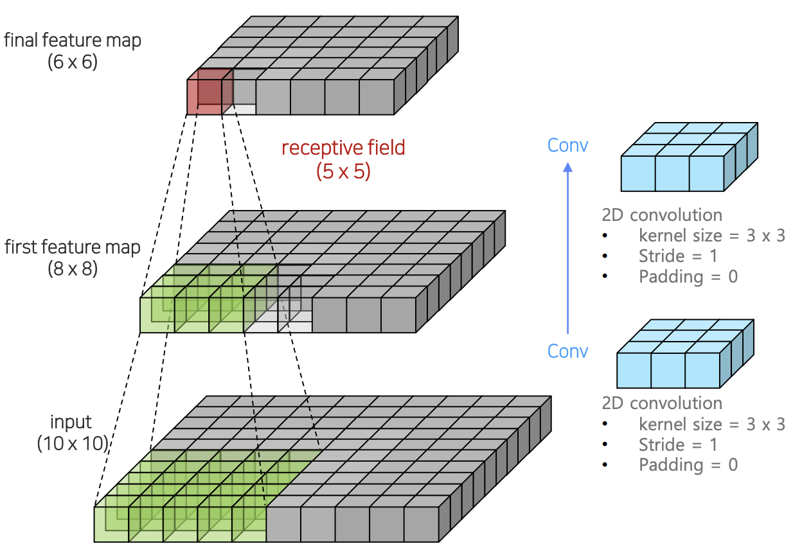
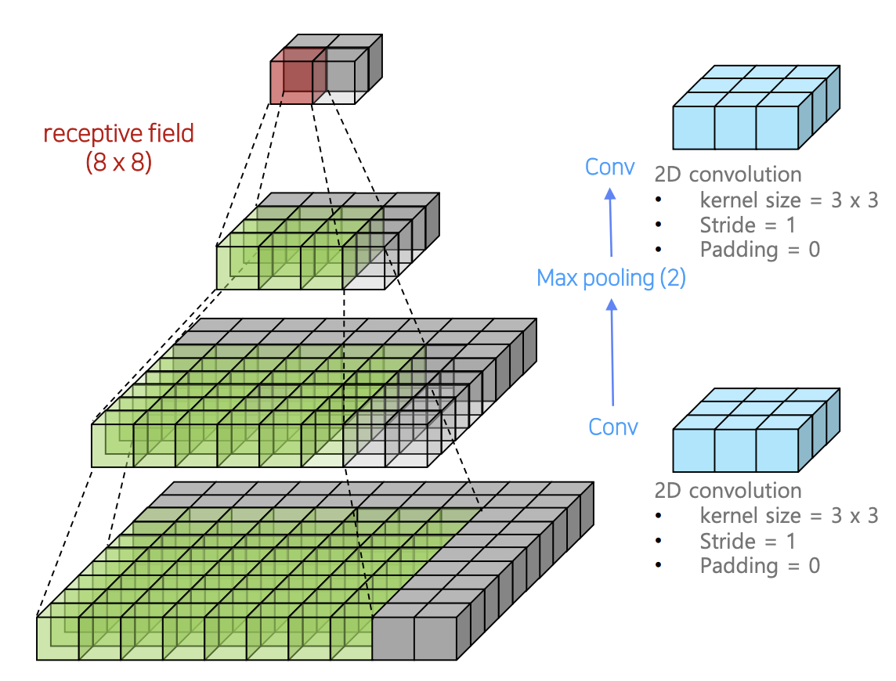
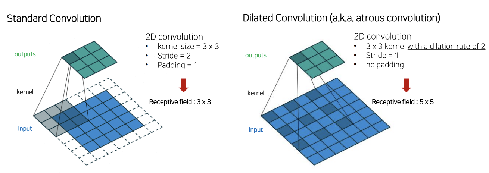

### Receptive field를 확장시킨 모델
- receptive field
 

- 위에서 보듯이 recpetive field를 구하는 것은 마지막 feature map의 픽셀이 처음의 어디와 연결되는지를 확인하면 구할 수 있음
---
 

- 위에서 보듯이 Conv->Max Pooling->Conv를 반복하면, 효율적으로 receptive field를 넓힐 수 있음
---
### Dilated Convolution
- 이미지의 크기는 많이 줄이지 않고, 파라미터의 수도 변함이 없는 채로 receptive field만 넓게 하는 방식
 

### DeepLab v1
- Dilated Convolution 사용해서 receptive field 늘렸음
- Dilated Convolution rate를 늘리면 빈 공간을 0으로 만들고 크기 키움(1이면 일반적인 Conv연산과 동일)
- 마지막 Upsampling 단계에서는 feature map크기를 넓혀주기 위해 bilinear interpolation 활용함
---
### Dense Conditional Random Field (Dense CRF)이용
- bilinear interpolation으로는 픽셀 단위의 정교한 segmentation이 불가능
- 이를 개선하기 위해 후처리 방법으로 Dense CRF
---
### CRF 원리
- 색상이 유사한 픽셀이 가까이 위치하며 같은 범주에 속함
- 색상이 유사해도 픽셀의 거리가 멀다면 같은 범주에 속하지 않음
- 모든 카테고리에 대해 적용하고, 픽셀 별 가장 높은 확률을 갖는 카테고리를 선택하여 최종 결과 도출
---
### Dilated Net
- 처음 3x3 Maxpool 대신 2x2 Maxpool을 사용하였고 conv5 블록에서 Pooling 부분이 사라짐.
- FC6에서 3x3 rate 12 대신 7x7 rate 4의 Dilated convolution을 활용
- Upsampling 방법 역시 기존 Bilinear interpolation에서 Deconvolution으로 변경
- ConvBlock이 Convolution + ReLU로 이루어져있다는 점은 Deeplab과 동일

- Dilated convolution에 padding을 rate와 동일하게 설정함
- 3x3 Dilated convolution은 계산해보면 padding과 rate가 같을 경우 이미지 크기의 변화가 없습니다. 7x7 Dilated Convolution에서도 rate 4, padding 12를 주어 이미지 크기의 변화가 없도록 해주었습니다.