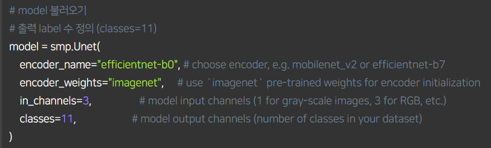
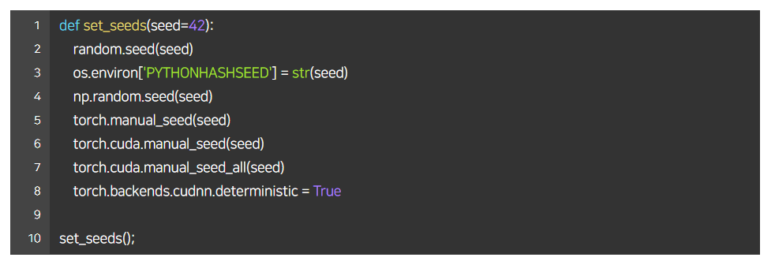

### In Segmentation Competition
- Library: Segmentation Models
    - 많은 형태의 Encoder-Decoder 모델을 제공
1. library download = !pip install git+https://github.com/qubvel/segmentation_models.pytorch
2. 설치한 것 import = import segmentation_models_pytorch as smp
3. 모델 불러오기 
  
- encoder weights의 name에 따라서 달라지는 것 있음 -> 공식문서 확인
--- 

### 주의해야할 사항들
1. 디버깅 모드: 실험환경이 잘 설정되었는지 체크하기 위한 과정
    - 실험이 작동되다 말 수도 있으니 미리 디버깅 해놓고 진짜 실험은 자기 전
- 샘플링을 통해서 데이터 셋의 일부분만 추출
- epoch 1~2정도 설정하여 loss가 감소하는지 확인
    - step에 따라 loss가 제대로 감소했다면 CFG.debug를 False로 바꿔서 전체 실험 진행
2. 시드 고정: 모델의 성능을 비교할 때, 성능이 달라지는 것을 방지하고 재생산해내기 위해 시드를 고정
- torch와 numpy, os 관련 시드 고정
 

- validation 검증셋의 시드 고정
3. 실험기록: 팀원 간의 정보 공유, 같은 실험 반복하지 않도록 방지
- Network 종류, Augmentation 방법, Hyperparameter 등 성능에 영향을 주는 조건을 바꿔가며 실험을 진행한 후 그 결과 기록
    - 이때 notion, Google 스프레드 시트, slack, 카카오톡 등을 이용
    - 파일 명에 실험을 기록하거나 패키지 등의 도움을 받기도 함
4. 실험은 한 번에 하나씩(하나의 조건만을 변경)
- 에를 들어 이전 실험 조건에서 Network 종류와 Augmentation 방법을 모두 변경하여 실험할 경우, 두 조건 중 어떤 조건이 영향을 주었는지 알기 어려움
5. 팀원간의 역할 분배
- baseline 코드의 성능을 높이는 것, 같은 task의 대회에서 우승자들의 solution, 문제점이 생겼을 때 해결방법 찾기, 대회 참여자들의 논의들
- solution과 discussion 조사는 한 사람이 하기
    - segmentation workshop, kaggle 등
- 독립적으로 베이스라인 코드를 만들어서 마지막에 앙상블 하는 것이 효과가 좋음
    - 한 가지 baseline만 가지고 하지 않고, 중복되지 않게 실험하는 것도 중요
### baseline 이후에 실험해봐야 할 사항들(밑에 나오는 것 말고도 다른 대회 우승자들의 기술도 실험 해보기)
#### Validation 해야 함
- 제출하지 않아도 성능 평가할 수 있고, Public 리더보드의 성능에 오버피팅 되지 않도록 도와준다.
---
1. Hold out
- 전체 데이터를 8:2로 분리 -> 해당 모델로 inference 진행
2. K-Fold
- 8:2로 분리하는 것은 같지만, Split 개념을 도입해 모든 데이터가 학습에 참여한다는 장점
- Split 수만큼 독립적인 모델을 학습하고 검증
- 독립적인 모델로 Test 데이터에 대해 각각 interface한 후, Ensemble
---
- 신뢰성 있는 검증결과를 가져올 수 있지만, 시간소요 많고 K의 선택해야 한다는 문제
- 실제로 잘 사용하지 않음 -> 3, 4를 많이 사용
3. Stratified K-Fold
- 기존의 K-Fold 방식은 Class Distribution을 고려하지 못함
- 이를 고려하여, Fold마다 class distribution을 동일하게 Split 방식으로, Class가 imbalance한 상황에서 좋음
- 즉, class의 비율을 균등하게 나누어 folding함
4. Group K-Fold
- train과 validation의 그룹을 나누어 힌트를 보지 않고 검증을 평가한다고 생각하면 좋음